

  
  <h1>Hi, I'm Ahmed Mones (Al-Taie)</h1>
  
  

  

    
    
    
  

---

## 👨‍💻 About Me

I am a **Senior Android Developer** with over **5 years of experience** specializing in **Kotlin**, **Jetpack Compose**, and **Compose Multiplatform (CMP)**.

- 🚀 Currently working as a **Lead Android Developer**, architecting scalable apps from scratch.
- 🎓 **Mentor** to 45+ junior developers, helping them master modern Android development.
- 🛠️ Creator of open-source tools like [`fingerprint_lib_android`](https://github.com/Al-Taie/fingerprint_lib_android) and [`expo-esim`](https://github.com/Al-Taie/expo-esim).
- 🏆 Former **GDSC Team Lead** and active community contributor.

---

## 🛠️ Tech Stack

### Mobile & Core

### Architecture & Libraries

### Tools & CI/CD

---

## 🌟 Featured Projects

### Open Source Libraries
| Project | Description | Tech |
| :--- | :--- | :--- |
| [**Fingerprint Lib**](https://github.com/Al-Taie/fingerprint_lib_android) | 👆 Seamless fingerprint scanner integration for Android. | Kotlin, Android SDK |
| [**Expo-eSIM**](https://github.com/Al-Taie/expo-esim) | 📱 Kotlin native module for eSIM activation in React Native. | Kotlin, React Native |

### Key Applications
- **[Fastlink App](https://play.google.com/store/apps/details?id=pl.dotsystems.fastlink)**: Flagship app rebuilt with Compose Multiplatform.
- **[FastSIM](https://play.google.com/store/apps/details?id=com.fastlink.fastsim)**: Agent app for digitizing SIM sales nationwide.
- **[First Iraqi Bank](https://play.google.com/store/apps/details?id=com.firstiraqibank.personal)**: Contributed to legacy XML maintenance and new Compose features.

---

## 📊 GitHub Stats

  <picture>
    <source media="(prefers-color-scheme: dark)" srcset="./profile/profile-night-rainbow.svg" />
    <source media="(prefers-color-scheme: light)" srcset="./profile/profile-night-rainbow.svg" />
    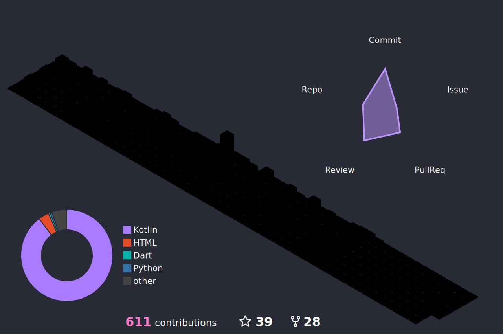
  </picture>

 

  <picture>
    <source media="(prefers-color-scheme: dark)" srcset="./profile/github-contribution-grid-snake-dark.svg" />
    <source media="(prefers-color-scheme: light)" srcset="./profile/github-contribution-grid-snake.svg" />
    
  </picture>

 

  

 

  
  

[//]: # (Keep this commented for now)
[//]: # (
)

[//]: # (  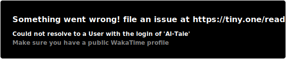)

[//]: # (
)

[//]: # ( )

---

## 🏆 Top Repositories

<!-- Automated Pins -->

  <a href="https://github.com/Al-Taie/CodeSignal"></a>
  <a href="https://github.com/Al-Taie/Marvel"></a>
  <a href="https://github.com/Al-Taie/MoviesApp"></a>
  <a href="https://github.com/Al-Taie/KanbanBoard"></a>

 

  <a href="https://github.com/Al-Taie/SuperHero"></a>
  <a href="https://github.com/Al-Taie/TriviaGame"></a>
  <a href="https://github.com/Al-Taie/Covid19Vaccine"></a>
  <a href="https://github.com/Al-Taie/Notes"></a>

---

  <a href="https://github.com/Al-Taie?tab=repositories">🔎 <b>Show More Repositories</b> 🔍</a>

